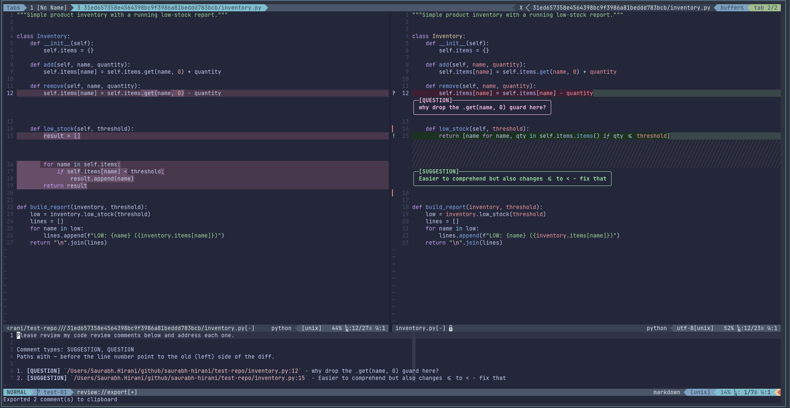

# review.nvim 🧐

An opinionated fork of [georgeguimaraes/review.nvim](https://github.com/georgeguimaraes/review.nvim). review.nvim gives you code review annotations for [codediff.nvim](https://github.com/esmuellert/codediff.nvim), tuned for AI feedback loops: you review a diff, drop comments on lines, and export them as structured markdown to paste into your coding agent.



*A review with two types from a custom config: a green suggestion and a magenta question. The top pane shows the comments inline on the diff (gutter icon, box, line tint); the bottom pane shows the exported markdown, including the custom preamble and per-line tags, ready to paste into a coding agent.*

## Why the fork?

The way you talk to a coding agent is personal. One person reviews with just "suggestion" and "question". Another wants "blocker", "nit", and "praise". The labels, the icons, the colours, the keys you press, and the words that wrap your exported comments are part of *your* workflow, not something a plugin should decide for you.

[georgeguimaraes/review.nvim](https://github.com/georgeguimaraes/review.nvim) is the plugin I forked, and it laid the whole foundation: a side-by-side diff with a file panel, comments on any line or range or whole file, each shown as a gutter icon, a coloured box, and a line highlight, plus per-branch persistence and markdown export. It works well and for most people it's all they need. But it ships a fixed set of comment types (Note, Suggestion, Issue, Praise) with fixed keymaps and fixed colours baked in. I wanted to define those myself. This fork takes the opposite stance:

**You bring your own constructs. The plugin imposes nothing.**

Out of the box this fork ships **zero** comment types, **zero** type keymaps, and **zero** type colours. On first run you define what a "comment" means to you: its name, its gutter icon, its colour, and the key that adds it. The plugin wires all of that up for you. The export preamble (the instructions your agent reads) is yours to write too.

If you want a batteries-included tool with sensible defaults, upstream is a fine choice. If you believe your review vocabulary should be yours to define, this fork is for you. A ready-to-copy starting config is in [Configuration](#configuration).

## Concepts

A comment **type** is whatever you say it is: a key in `comment_types` with a `name`, an `icon`, a keymap `key`, and two highlight-group names (`hl` and `line_hl`). The examples throughout this README use three types — **suggestion** 💡, **question** ❓ and **note** 📝 — but they are examples, not defaults; nothing ships with the plugin.

When you add a comment of a type, you get **three visual elements** in the diff:

1. **The gutter icon** — the `icon` string rendered as a sign in the sign column (e.g. `💡` or `❓`). Coloured by `hl`.
2. **The comment box** — a bordered virtual-text box below the line showing `[NAME]` and your text. Coloured by `hl`.
3. **The line highlight** — a background tint across the commented line(s). Coloured by `line_hl`. For a multi-line comment, every line in the range is tinted.

```
  8 │💡 todos = {}          ← gutter icon (hl colour)
    │  ┌[SUGGESTION]────┐   ← comment box   (hl colour)
    │  │ prefer a set    │
    │  └─────────────────┘
  9 │   users = {}         ← line 8-9 background tinted (line_hl colour)
```

So each type maps to: `icon` → the sign, `hl` → the sign + box colour, `line_hl` → the line background. These are the knobs you set per type. **Nothing is defined by default.** You create the highlight groups yourself (see [Configuration](#configuration)) and reference them by name, or point `hl`/`line_hl` at groups your colourscheme already provides (e.g. `DiagnosticHint`).

Types also differ in *who* they are for, which is what makes [export filtering](#filtering-the-export) useful: 💡 suggestion and ❓ question are instructions for the agent, while 📝 note is a reminder to yourself that never needs to leave the editor.

## Requirements

- Neovim >= 0.9
- [codediff.nvim](https://github.com/esmuellert/codediff.nvim)
- [nui.nvim](https://github.com/MunifTanjim/nui.nvim)

## Installation

Using [lazy.nvim](https://github.com/folke/lazy.nvim). Because nothing ships by default, the plugin is only useful once you define at least one comment type, so installation and configuration are the same step. See [Configuration](#configuration) for the full minimal setup; the spec below is the skeleton:

```lua
{
  "saurabh-hirani/review.nvim",
  dependencies = {
    "esmuellert/codediff.nvim",
    "MunifTanjim/nui.nvim",
  },
  cmd = { "Review" },
  keys = {
    { "<leader>Ro", "<cmd>Review<cr>", desc = "Review open" },
    { "<leader>Rc", "<cmd>Review commits<cr>", desc = "Review commits" },
  },
  opts = {
    -- REQUIRED: define your own comment types (see Configuration).
    comment_types = {},
    popup = { type_order = {} },
  },
}
```

> If `comment_types`/`popup.type_order` are empty, adding a comment shows an error telling you to configure types. That is intentional. The plugin has no opinion about your review vocabulary.

## Usage

```vim
:Review              " Open codediff with review keymaps (default)
:Review open         " Same as above
:Review commits      " Select commits to review (picker modal)
:Review commits SHA  " Review a single commit (diffs SHA^ against SHA)
:Review commits REV1 REV2  " Review a specific revision range (skips picker)
:Review close        " Close and export comments to clipboard
:Review export       " Export comments to clipboard
:Review preview      " Preview exported markdown in a split
:Review sidekick     " Send comments to sidekick.nvim
:Review list         " List all comments
:Review delete       " Multi-select picker to bulk-delete comments
:Review clear        " Clear all comments
:Review toggle       " Toggle readonly/edit mode
:Review marks        " Toggle comment marks visibility
:Review annotate     " Add a comment at the cursor on any buffer (no diff view)
```

## Workflow

Open a review with `:Review` to see your staged and unstaged changes in a side-by-side diff, or `:Review commits` to pick specific commits. The diff opens in a new tab with a file panel on the left.

Navigate files with `<Tab>` / `<S-Tab>`. Toggle the file panel with `f`. Press `t` to toggle side-by-side vs inline layout. When you spot something, press `i` on the line and pick a type from the menu. The menu shows exactly the types *you* defined. The comment renders as a box below the line with your icon in the gutter and a line-background tint (see [Concepts](#concepts)).

For a multi-line comment, visually select the range first, then press `i`. For a file-level comment, press `F`. Comments on the old (left) side show only there; same for the new (right) side.

Use `]n` / `[n` to jump between comments, `e` to edit, `d` to delete, `D` to bulk-delete. Press `c` to list all comments and jump to any of them. Press `?` for a help popup listing your active keymaps.

When you're done, press `q` to close. This copies all comments to the clipboard as structured markdown and shows a preview. Paste it into your agent, or press `S` to send to [sidekick.nvim](https://github.com/folke/sidekick.nvim). The format looks like this:

```
1. **[SUGGESTION]** `src/api.py:23` - prefer a set here
2. **[QUESTION]** `src/utils.py:~10` - why was this removed?
```

Lines prefixed with `~` refer to the old (left) side of the diff. Ranges use `start-end`. Types you keep for yourself (📝 note, in the [Configuration](#configuration) example) stay in the diff and never show up here — see [Filtering the export](#filtering-the-export).

Comments persist per branch, in `~/.local/share/nvim/review/`, so you can close Neovim and resume later. Saved reviews are kept forever by default; set `storage.expiry_days` to a positive number to have a review deleted once its file has gone that long without a change (adding or editing any comment resets the clock).

## Configuration

This is a complete, ready-to-copy setup for three types: 💡 **suggestion** (green, agent fixes it), ❓ **question** (magenta, agent explains it) and 📝 **note** (blue, reminder to yourself). It defines the types, the highlight groups they reference, a custom export preamble, and an export filter that keeps notes out of the clipboard. Adapt the names, icons, keys, and colours to your own review vocabulary.

```lua
{
  "saurabh-hirani/review.nvim",
  dependencies = { "esmuellert/codediff.nvim", "MunifTanjim/nui.nvim" },
  cmd = { "Review" },
  keys = {
    { "<leader>Ro", "<cmd>Review<cr>", desc = "Review open" },
    { "<leader>Rc", "<cmd>Review commits<cr>", desc = "Review commits" },
    { "<leader>Rm", "<cmd>Review marks<cr>", desc = "Review toggle marks" },
    { "<leader>Rd", "<cmd>Review delete<cr>", desc = "Review delete comments" },
    { "<leader>Re", "<cmd>Review export<cr>", desc = "Review export" },
  },
  opts = {
    -- Your review vocabulary. Each type is: name, icon (gutter sign),
    -- key (its add-keymap suffix), hl (sign + box colour), line_hl (line tint).
    comment_types = {
      suggestion = { key = "s", name = "Suggestion", icon = "💡", hl = "ReviewSuggestion", line_hl = "ReviewSuggestionLine" }, -- agent: fix this
      question   = { key = "q", name = "Question",   icon = "❓", hl = "ReviewQuestion",   line_hl = "ReviewQuestionLine" },   -- agent: explain this
      note       = { key = "n", name = "Note",       icon = "📝", hl = "ReviewNote",       line_hl = "ReviewNoteLine" },       -- you: remember this
    },
    popup = {
      -- which types appear in the picker (and in what order), and the default
      type_order = { "suggestion", "question", "note" },
      default_type = "suggestion",
    },
    export = {
      path_style = "absolute", -- or "relative"
      header = "Please review my code-review comments below and address each one.",
      side_note = "Paths with ~ before the line number point to the old (left) side of the diff.",
      -- notes are for you, not the agent: they stay in the diff, out of the export
      types = { "suggestion", "question" },
    },
  },
  config = function(_, opts)
    -- No type colours ship by default, so define the highlight groups your
    -- comment_types reference. Re-apply on every ColorScheme event so they
    -- survive a colourscheme switch (a plain one-time call works too if you
    -- never change colourscheme).
    local function review_hl()
      local set_hl = vim.api.nvim_set_hl
      set_hl(0, "ReviewSuggestion",     { fg = "#a6e3a1", bold = true }) -- green sign + box
      set_hl(0, "ReviewQuestion",       { fg = "#f5c2e7", bold = true }) -- magenta sign + box
      set_hl(0, "ReviewNote",           { fg = "#89b4fa", bold = true }) -- blue sign + box
      set_hl(0, "ReviewSuggestionLine", { bg = "#1e3320" })              -- green line tint
      set_hl(0, "ReviewQuestionLine",   { bg = "#3a1f33" })              -- magenta line tint
      set_hl(0, "ReviewNoteLine",       { bg = "#1e2a3f" })              -- blue line tint
    end
    vim.api.nvim_create_autocmd("ColorScheme", {
      group = vim.api.nvim_create_augroup("ReviewHighlights", { clear = true }),
      callback = review_hl,
    })
    review_hl()
    require("review").setup(opts)
  end,
}
```

With this config, the plugin automatically gives each type an edit-mode add-keymap: `<localleader>cs` (suggestion), `<localleader>cq` (question) and `<localleader>cn` (note), derived from `add_type_prefix` + each type's `key`.

Emoji icons need a terminal font with emoji support; if they show up as empty boxes, use plain text like `!`, `?` and `*` instead.

### Comment types

Each entry in `comment_types` is a table:

| Field | Purpose |
|-------|---------|
| `name` | Label shown in the box (`[NAME]`) and the export tag |
| `icon` | Gutter sign glyph. Any 1–2 cell string — emoji (`💡`, `❓`, `📝`) or plain text (`!`, `?`, `S!`). No icon fonts or images needed |
| `key` | Single char; combined with `add_type_prefix` to form the add-keymap (key `s` → `<localleader>cs`) |
| `hl` | Highlight-group name for the sign icon and comment box |
| `line_hl` | Highlight-group name for the whole-line background tint (omit for no tint) |

`comment_types` **replaces** the defaults wholesale. If you supply it, only your types exist (built-ins do not merge in). `popup.type_order` decides which of them are active and in what order; a type absent from `type_order` gets no menu entry, no keymap, and no export mention.

### Filtering the export

Not every type is meant for the agent. Say you define three: **suggestion** is something you want the agent to fix, **question** is something you want it to explain, and **note** is a reminder to yourself while reading the diff. The first two are instructions; the third is just for you, so there is no point shipping it to the agent.

`export.types` lists the type keys that reach the clipboard. Everything else stays visible in the diff — icon, box, line tint, `]n` navigation — but is left out of the export (`C`, `q`, `:Review export`, `:Review preview`, and sidekick all honour it). Omit the option to export every type. With the three types from [Configuration](#configuration), that is a one-line filter:

```lua
export = {
  types = { "suggestion", "question" }, -- 📝 notes stay local, never sent to the agent
}
```

The exported `Comment types:` line and the comment numbering both follow the filter, so the agent never sees a type you excluded.

### Keymap options

All keymaps can be set to `false` to disable them. Per-type add-keymaps are **not** listed here; they are derived from `add_type_prefix` + each type's `key`.

| Option | Default | Action |
|--------|---------|--------|
| `add_comment` | `<localleader>cc` | Add comment, pick type from menu (edit mode) |
| `add_type_prefix` | `<localleader>c` | Prefix for per-type add-keymaps (`prefix .. key`) |
| `add_file_comment` | `<localleader>cf` | Add file-level comment (edit mode) |
| `delete_comment` | `<localleader>cd` | Delete comment (edit mode) |
| `edit_comment` | `<localleader>ce` | Edit comment (edit mode) |
| `next_comment` | `]n` | Next comment |
| `prev_comment` | `[n` | Previous comment |
| `next_file` | `<Tab>` | Next file |
| `prev_file` | `<S-Tab>` | Previous file |
| `toggle_file_panel` | `f` | Toggle file panel |
| `list_comments` | `c` | List all comments |
| `export_clipboard` | `C` | Export to clipboard |
| `send_sidekick` | `S` | Send comments to sidekick |
| `clear_comments` | `<C-r>` | Clear all comments |
| `close` | `q` | Close and export |
| `toggle_readonly` | `R` | Toggle readonly/edit mode |
| `readonly_add` | `i` | Add comment (readonly mode) |
| `readonly_delete` | `d` | Delete comment (readonly mode) |
| `readonly_delete_multi` | `D` | Multi-select delete (readonly mode) |
| `readonly_edit` | `e` | Edit comment (readonly mode) |
| `readonly_add_file` | `F` | Add file-level comment (readonly mode) |
| `show_help` | `?` | Show review keymaps help popup |
| `popup_submit` | `<C-s>` | Submit comment (popup) |
| `popup_cancel` | `q` | Cancel comment (popup, normal mode) |
| `popup_cycle_type` | `<Tab>` | Cycle comment type (popup) |

### Other options

| Option | Default | Purpose |
|--------|---------|---------|
| `codediff.readonly` | `true` | Start reviews readonly (simple keys like `i`/`e`/`d`); set `false` for edit-mode `<localleader>` keymaps |
| `codediff.restore_edit_on_close` | `false` | Keep buffers readonly after closing (prevents line drift) |
| `export.path_style` | `"relative"` | `"relative"` or `"absolute"` file paths in exported comments |
| `export.header` | intro sentence | First line(s) of the export; `false` to omit |
| `export.side_note` | `~` explanation | Note about the `~` (old-side) prefix; `false` to omit |
| `export.types` | `nil` (all types) | List of type keys to export; other types stay in the diff but are left out of the export |
| `popup.type_order` | `{}` | Active types, in order |
| `popup.default_type` | `nil` | Type selected first in the picker |
| `storage.expiry_days` | `0` (never) | Days a saved review survives without a change; `0` or `false` keeps reviews forever |

### Keybindings in the diff view

**Readonly mode** (default):

| Key | Action |
|-----|--------|
| `i` | Add comment (pick type from menu) |
| `d` | Delete comment at cursor |
| `D` | Multi-select delete comments |
| `e` | Edit comment at cursor |
| `F` | Add file-level comment |
| `c` | List all comments |
| `f` | Toggle file panel |
| `R` | Toggle readonly/edit mode |
| `<Tab>` / `<S-Tab>` | Next / previous file |
| `]n` / `[n` | Next / previous comment |
| `C` | Export to clipboard and preview |
| `S` | Send comments to sidekick.nvim |
| `<C-r>` | Clear all comments |
| `q` | Close and export |
| `t` | Toggle side-by-side/inline layout |
| `?` | Show review keymaps help |
| `g?` | Show codediff help |

**Edit mode** (when `codediff.readonly = false`): add with `<localleader>cc` (menu), each type via `<localleader>c` + its `key`, `<localleader>cf` (file), `<localleader>cd` (delete), `<localleader>ce` (edit).

**Comment popup**: `Ctrl+s` submit, `Tab` cycle type, `Enter` newline (multi-line supported), `Esc`/`q` cancel.

## Export Format

Comments are exported as markdown optimized for AI consumption. The `Comment types:` line is generated from `popup.type_order`, your type `name`s and the `export.types` filter; the intro and `~` note are your configurable `export.header` and `export.side_note`. This is what the [Configuration](#configuration) example produces — 💡 suggestions and ❓ questions are here, 📝 notes are not:

```markdown
Please review my code-review comments below and address each one.

Comment types: SUGGESTION, QUESTION
Paths with ~ before the line number point to the old (left) side of the diff.

1. **[SUGGESTION]** `/abs/path/src/api.py:23` - prefer a set here
2. **[QUESTION]** `/abs/path/src/utils.py:~45` - why was this removed?
3. **[SUGGESTION]** `/abs/path/src/auth.py:12-18` - extract this into a helper
```

Lines prefixed with `~` (e.g. `:~45`) refer to the old (left) side of the diff. Range comments use `start-end` notation.

## Running Tests

```bash
make test
```

## Features added in the fork

Built on top of [upstream](https://github.com/georgeguimaraes/review.nvim):

- **Fix focus stealing** ([#1](https://github.com/saurabh-hirani/review.nvim/pull/1)) — file selection in the explorer no longer steals focus back to the diff pane, and review keymaps no longer override explorer keymaps (from upstream [PR #31](https://github.com/georgeguimaraes/review.nvim/pull/31), not yet merged).
- **Absolute path export** ([#2](https://github.com/saurabh-hirani/review.nvim/pull/2)) — `export.path_style = "absolute"` includes full file paths, unambiguous when pasting into agents.
- **Configurable comment type order** ([#3](https://github.com/saurabh-hirani/review.nvim/pull/3)) — `popup.type_order` and `popup.default_type` choose which types appear and in what order.
- **Toggle marks visibility** ([#4](https://github.com/saurabh-hirani/review.nvim/pull/4)) — `:Review marks` (or a keymap) toggles comment marks on/off.
- **Restore edit on close** ([#5](https://github.com/saurabh-hirani/review.nvim/pull/5)) — `codediff.restore_edit_on_close` controls whether buffers stay readonly after closing (default: readonly, to prevent line drift).
- **Multi-select delete** ([#6](https://github.com/saurabh-hirani/review.nvim/pull/6)) — `D` in readonly mode or `:Review delete` opens an fzf multi-select picker to bulk-delete comments.
- **Keep marks visible on close** ([#8](https://github.com/saurabh-hirani/review.nvim/pull/8)) — marks stay on buffers after closing so comments remain visible; `:Review marks` hides them.
- **Annotate normal buffers** ([#9](https://github.com/saurabh-hirani/review.nvim/pull/9)) — annotate any buffer without opening the diff view; the export preview is editable (`:w` re-copies to clipboard).
- **Scope review to its own sessions** ([#10](https://github.com/saurabh-hirani/review.nvim/pull/10)) — review only attaches to codediff sessions it opened via `:Review`; a bare `:CodeDiff` stays plain codediff.
- **Bring your own comment types** ([#12](https://github.com/saurabh-hirani/review.nvim/pull/12)) — the headline overhaul of this fork. Upstream's built-in types, their keymaps, and their colours are all removed. The plugin now ships nothing by default and hands every construct to you:
  - **No default types** — you define `comment_types` entirely; the built-ins no longer leak in via config merge, and you supply your own highlight groups for each type's colour.
  - **Derived per-type keymaps** — each type's add-keymap is built from `add_type_prefix .. type.key` (e.g. prefix `<localleader>c` + key `s` = `<localleader>cs`). Define a type, get its keymap for free. No hardcoded `add_note`/`add_praise`.
  - **Configurable export preamble** — `export.header` and `export.side_note` let you write the exact instructions your agent sees. Set either to `false` to omit it.
- **Filter which types are exported** ([#13](https://github.com/saurabh-hirani/review.nvim/pull/13)) — `export.types` picks the type keys that reach the clipboard. Types left out stay fully visible in the diff (icon, box, tint, navigation) but never reach the agent, so a "note to self" type can live alongside types meant as instructions.
- **Configurable review expiry** ([#14](https://github.com/saurabh-hirani/review.nvim/pull/14)) — `storage.expiry_days` replaces upstream's hardcoded 7-day cleanup, and the default flips to keeping reviews forever. Set a positive number of days to opt into cleanup.

## License

Licensed under the Apache License, Version 2.0. See [LICENSE](LICENSE) for details.

Copyright 2025 George Guimarães (original [review.nvim](https://github.com/georgeguimaraes/review.nvim)).
Copyright 2025 Saurabh Hirani (fork modifications).
